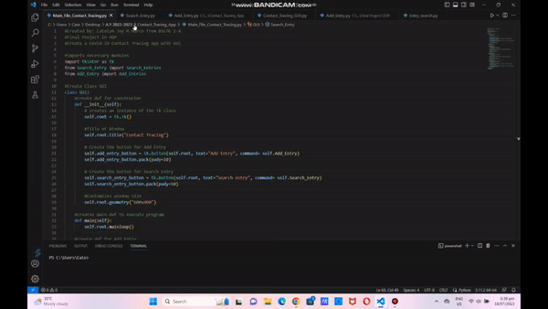

# Contact_Tracing_App
This repository contains a python program for a Covid-19 Contact Tracing App which utilizes the module "Tkinter". The app is divided into 3 python files; Main_File_Contact_Tracing, Add_Entry, and Search_Entry. 

The main file is for the starting page of the program, it holds the buttons for Add Entry and Search Entry. 

The Add_Entry allows users to add their own entry which will be recorded in the "All Entries" folder, logbook, and confirmed cases if the user responded with "Yes-Positive" in the question "Have you been tested for the last 14 days?". The users are asked to fill out the following information: full name, age, gender, address, contact details, location visted in the past 14 days, and whether the user have been tested for Covid-19 the past 14 days. For the location, the users can search locations they've visited and select them in the list box labeled "Results". Users are also provided an option to deselect their previously selected locations. If the location is not available within the results of the suggested search, they are provided an option to add the missing location and it will then appear in the results of the suggested search once it is added. After submission, the user will be given an option to view possible contacts with confirmed patients within the last 14 days. The "possible contacts" window will display the number of confirmed patients present within the locations the user visited the last 14 days. The window automatically excludes any confirmed cases that occurred more than 14 days ago from the count.

The Search_Entry allows the user to view previous entries via a search bar. Once the user have input the name of the individual they wish to view, the name will be displayed in the list box labeled "Results". As the user select the option within the results, the text file will be automatically displayed for the user to view. The users are also given the option to view log books which will display the number of entries, their names, as well as the timestamp in which the entry was submitted.

Note: Please make sure to modify the "file_path" within the "export_input" method of the "Add_Entry" python file to your preferred file path. Also, update the file paths indicated in the calls to the method "self.generate_suggestion()" within the "check" method of the "Search_Entry" python file, and don't forget to adjust the "folder_path" within the "fillout" method in the "Search_Entry" python file accordingly. 
# Demo

# Needed Module
Tkinter

The tkinter package (“Tk interface”) is the standard Python interface to the Tcl/Tk GUI toolkit. Both Tk and tkinter are available on most Unix platforms, including macOS, as well as on Windows systems. Tkinter is the standard GUI library for Python. Tkinter provides a powerful object-oriented interface to the Tk GUI toolkit. 

# Tkinter Features
Tkinter offers the following features:

-Displaying Text and Images With Label Widgets

-Displaying Clickable Buttons With Button Widgets

-Getting User Input With Entry Widgets

-Getting Multiline User Input With Text Widgets

-Assigning Widgets to Frames With Frame Widgets

-Adjusting Frame Appearance With Reliefs

-Understanding Widget Naming Conventions

-Check Your Understanding

-Controlling Layout With Geometry Managers
